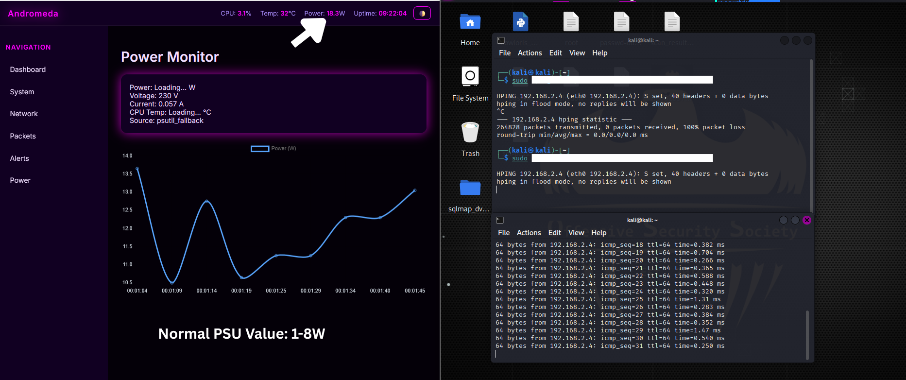

# This markdown file contains all of the penetration testing done to the Andromeda Server. For more, visit `/home_laboratory/andromeda/screenshots`

## Comamnds Used:
### Tool 1: Nikto
- `sudo nikto -h 192.168.2.4:5000 -o scan_results.txt` -> Saves Output to File
- `sudo nikto -h 192.168.2.4:5000 -Plugins ALL` -> Enables all Plugins
- `sudo nikto -h 192.168.2.4 -p 5000` -> Targeting the Dashboard's port
- `sudo nikto -h 192.168.2.4 -Tuning 9`:

### Common Turning Options
- Interesting Files (1)
- Misconfigurations (2)
- Information Disclosure (3)
- Injection Tests (4)
- All of the above (9)

- `sudo nikto -h 192.168.2.4 -p 5000` -> Targeting the Dashboard's port

## DDoS Attacks to Andromeda using Hping3
### Commands Used:
- `sudo hping3 -S 80 192.168.2.4 --flood -i u10000` -> SYN Flood (CPU stress) ~ 200 Packets
  
  - ```bash
    --- 192.168.2.4 hping statistic ---
    653729 packets transmitted, 0 packets received, 100% packet loss
    round-trip min/avg/max = 0.0/0.0/0.0 ms
    ```
- `sudo hping3 -S 80 192.168.2.4 --flood -i u10000` -> SYN Flood (CPU stress) ~ 1000 Packets

  - ```bash
    --- 192.168.2.4 hping statistic ---
    344211 packets transmitted, 0 packets received, 100% packet loss
    round-trip min/avg/max = 0.0/0.0/0.0 ms
    ```

- `sudo hping3 -S --flood --rand-source -p ++1 192.168.2.4 -i u1000` -> Full Port Range Scan Flood

  - ```bash
     --- 192.168.2.4 hping statistic ---
    67285 packets transmitted, 0 packets received, 100% packet loss
    round-trip min/avg/max = 0.0/0.0/0.0 ms
    ```

- `sudo hping3 -S -p 5000 192.168.2.4 --flood -i u100 ` -> HTTP Layer Stress Test for Flask App

  - ```bash
    --- 192.168.2.4 hping statistic ---
    29900 packets transmitted, 0 packets received, 100% packet loss
    round-trip min/avg/max = 0.0/0.0/0.0 ms
    ``` 
## Short Pentest Summary
Several controlled DDoS scenarios were performed against the Andromeda host using hping3 to evaluate its behavior under high-volume packet floods. SYN flood tests at different intensities, randomized source attacks, and full port-range floods all produced complete packet loss with zero responses, indicating that the system became unreachable but did not crash. Even during targeted stress on the Flask service (port 5000), the host consistently dropped traffic without logging or mitigation. Overall, Andromeda remained stable but lacked any active defense mechanisms beyond basic packet dropping.



## Problems Encountered
- Lynis could not be installed since DNS Server was failing.
  - Fix:
  - `sudo tailscale set --exit-node=` -> Check Tailscale DNS Settings
  - `sudo tailscale set --accept-dns=false`
  - `sudo nano /etc/systemd/resolved.conf` -> Permanent DNS Configuration
  - Added modified lines:
    - ```bash
      DNS=8.8.8.8 8.8.4.4 1.1.1.1
      FallbackDNS=208.67.222.222 208.67.220.220
      Domains=~.
      DNSSEC=allow-downgrade
      DNSOverTLS=no
      ```

    - `sudo rm -f /etc/resolv.conf` -> Remove the old configuration file and restart
    - `sudo systemctl restart systemd-resolved`
    - `sudo systemctl enable systemd-resolved` -> Enable the configuration
    - `sudo ln -sf /run/systemd/resolve/stub-resolv.conf /etc/resolv.conf`
- Packages are now fixed and `archive.ubuntu` is reachable:
  - `sudo apt update -y`
  - `sudo apt --fix-broken install -y`
  - `sudo apt upgrade -y`

## Ethical and Legal Disclaimer
All penetration testing and stress-testing activities described in this documentation were performed solely within a closed, private environment with explicit authorization on systems owned and controlled by the tester. The commands, methods, or techniques referenced here must not be used on any system without clear permission from its owner or administrator. The author assumes no responsibility for misuse of this information or for any damage resulting from unauthorized or unethical activity.
